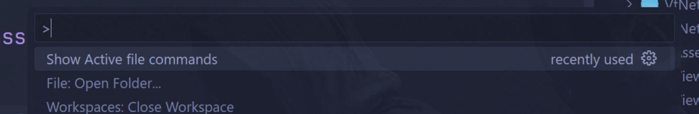
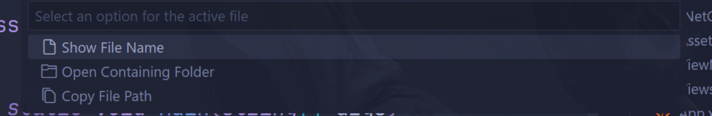

# ActiveFileName README

A VS Code extension that displays the name of the currently active file in the status bar with quick access to file operations.

## Features

- **Active File Display**: Shows the name of the currently active file in the VS Code status bar
- **Real-time Updates**: Automatically updates when you switch between files or when the active document changes
- **Interactive Status Bar**: Click the status bar item to access file operations through a quick pick menu
- **Multiple File Actions**: Access common file operations without leaving your current view
- **Clean Interface**: Simple, unobtrusive display that integrates seamlessly with VS Code's status bar

The extension adds a clickable status bar item on the left side that shows just the filename (without the full path) of the currently active editor. When no file is open, the status bar item will be hidden.

## Available Actions

Click on the active filename in the status bar to access these options:

- **Show File Name**: Display the current filename in an information message
- **Open Containing Folder**: Reveal the file's folder in your operating system's file explorer
- **Copy File Path**: Copy the full file path to your clipboard

## Requirements

- VS Code version 1.101.0 or higher

## Extension Settings

This extension does not add any VS Code settings. It works out of the box with no configuration required.

## How It Works

The extension:
1. Creates a clickable status bar item when activated
2. Displays the filename of the currently active editor
3. Updates automatically when you switch between files or when document content changes
4. Shows a tooltip "Active File Name" when you hover over the status bar item
5. Opens a quick pick menu with file operations when clicked

## Commands

The extension registers the following commands:

- `activefilename.showFileOptions`: Shows the quick pick menu with file options
- `activefilename.showFileName`: Displays the current filename
- `activefilename.openFolder`: Opens the containing folder in the OS file explorer
- `activefilename.copyPath`: Copies the full file path to clipboard

## Known Issues

None at this time. If you encounter any issues, please report them on the project repository.

## Release Notes

### 0.0.2

Initial release of ActiveFileName extension
- Added active file name display in status bar
- Real-time updates when switching between files
- Tooltip support for better user experience
- Interactive status bar with quick access to file operations
- Comamnds
    - Show file name.
    - open containing folder. 
    - copy file path actions

---

## Following extension guidelines

This extension follows the VS Code extension guidelines and best practices.

* [Extension Guidelines](https://code.visualstudio.com/api/references/extension-guidelines)

**Enjoy!**
